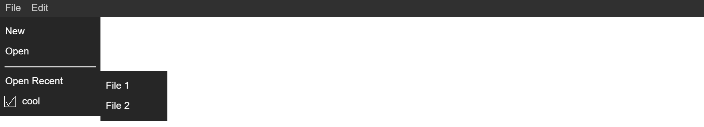

# StageXL Main Menu

Main Menu is a package for StageXL which allows developers to easily add a main menu to their project



## Example
```dart
MainMenu mainMenu = MainMenu();
stage.addChild(mainMenu);
```

## Adding items
```dart
MenuButton file = mainMenu.addMenuItem("File");

file.addMenuItem("New").onMouseClick.listen((Event e) {
  print("New was clicked");
});

file.addMenuItem("Open");

file.addSeperator();
```

## Adding sub items
```dart
file.addMenuItem("Open Recent")..addMenuItem("File 1")..addMenuItem("File 2");
```


## Adding checkbox items
```dart
CheckboxMenuItem cb = file.addCheckboxMenuItem("cool", true);
cb.onIsCheckedChanged.listen((Event e) {
  print(cb.isChecked);
});
```

## Adding another menu button
```dart
mainMenu.addMenuItem("Edit")..addMenuItem("Cut")..addMenuItem("Copy");
```

## Adding styling
```dart
mainMenu
  ..fileMenuBackColor = 0xff303030
  ..menuButtonBackColor = 0xff303030
  ..menuButtonHighlightColor = 0xff505050
  ..menuButtonTextColor = 0xffCCCCCC
  ..menuButtonTextSize = 15
  ..menuItemBackColor = 0xff262626
  ..menuItemHighlightColor = 0xff505050
  ..menuItemTextColor = 0xffffffff
  ..menuItemTextSize = 15
  ..seperatorColor = 0xffCCCCCC;
```

## sizing and positioning
```dart
stage.onResize.listen(onResize);

void onResize(Event e) {
  mainMenu.x = 0;
  mainMenu.y = 0;
  mainMenu.width = stage.stageWidth;
}
```
